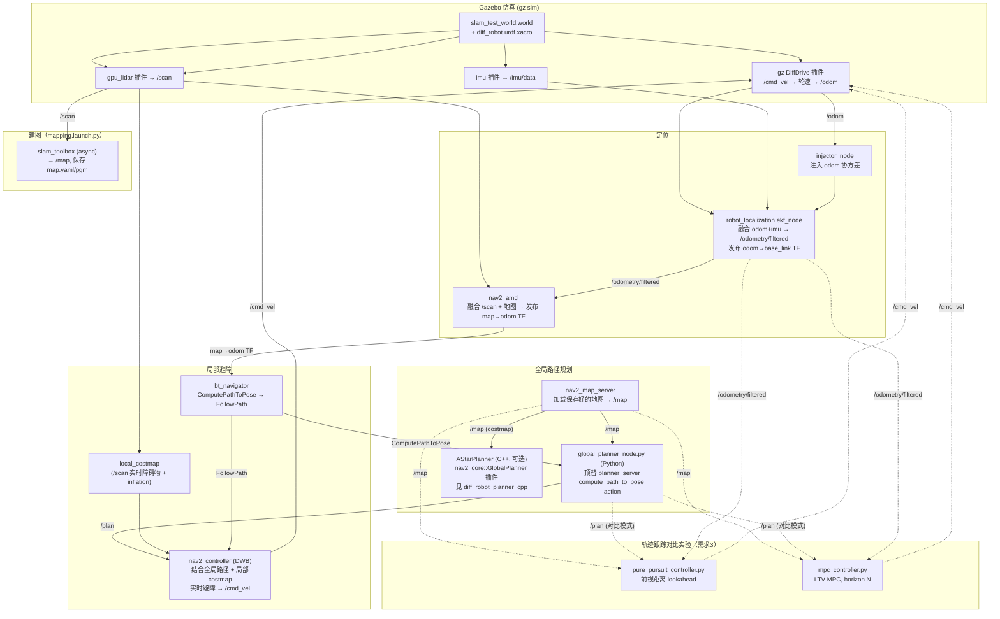

# diff_robot：差速驱动机器人自主导航仿真平台

ROS2 Jazzy + Gazebo 环境下的差速驱动机器人仿真与自主导航闭环：地图构建 (SLAM) →
全局路径规划 (A\*，Python + C++ 双实现) → 局部避障 (Nav2/DWB) → 轨迹跟踪
(Pure Pursuit / MPC 对比调参)。URDF、Gazebo 世界文件、EKF/SLAM 基础配置来自
`diff_robot_description` 包；本次新增 `diff_robot_navigation`
（Python 导航栈）和 `diff_robot_planner_cpp`（C++ A* 核心 + Nav2 插件）两个包。

## 目录结构

```
diff_robot_ws/
├── src/
│   ├── diff_robot_description/   # URDF、Gazebo 世界、EKF/SLAM 基础配置
│   ├── diff_robot_navigation/    # A*(Python) + Nav2/DWB 集成 + Pure Pursuit/MPC 控制器（新增）
│   └── diff_robot_planner_cpp/   # A* C++ 核心 + Nav2 全局规划器插件（新增）
└── docs/
    ├── RUN_STEPS.md              # 从零开始的详细运行步骤
    ├── tuning_log.md             # 实测调参记录（前视距离/MPC horizon 扫描、C++ vs Python 耗时等）
    └── figures/                  # tuning_log.md 引用的图表
```

## 系统架构



实线是"完整自主导航闭环"（`navigation.launch.py`：A* + Nav2/DWB）的数据流，虚线是
"轨迹跟踪对比实验"（`compare_controllers.launch.py`：跳过 DWB，直接对比 Pure
Pursuit / MPC）的数据流，二者共用同一个 A* 规划节点和同一套 EKF 定位。

## 需求对照表

| 需求 | 落地位置 | 备注 |
|---|---|---|
| 1. 独立搭建仿真平台，完整闭环 | `diff_robot_navigation/launch/{mapping,navigation,compare_controllers}.launch.py` | 见 `docs/RUN_STEPS.md` |
| 2. Python A* + Nav2/DWA 实时避障，动态起终点，路径平滑无碰撞 | `diff_robot_navigation/diff_robot_navigation/{astar.py,global_planner_node.py}` + `config/nav2_params.yaml`(DWB) | 正确性/无碰撞由 `test/test_astar.py` 覆盖；动态起终点见 `scripts/visualize_astar_demo.py` 的多组随机用例 |
| 3. Pure Pursuit vs MPC，参数调优，误差与平顺性 | `diff_robot_navigation/diff_robot_navigation/{control_models.py,pure_pursuit_controller.py,mpc_controller.py}` | 实测调参数据见 `docs/tuning_log.md` 第2-4节，如实报告了 MPC **不是**在所有速度下都更优 |
| 4. C++ 重构 A* 核心，验证多语言能力 | `diff_robot_planner_cpp/{include,src}/astar_core.{hpp,cpp}` + `astar_planner.{hpp,cpp}`(Nav2插件) | C++ vs Python 求解耗时实测对比见 `docs/tuning_log.md` 第5节（140×140栅格下约24×加速，均值1.9ms） |
| 系统架构图、运行步骤、调参记录 | 本文件 + `docs/RUN_STEPS.md` + `docs/tuning_log.md` | |
| 仿真演示视频 | 待录制，见 `docs/RUN_STEPS.md` 第7步的录制建议 | 需要真实 ROS2/Gazebo 环境 |

## 快速开始

```bash
# 0. 不需要 ROS2 就能跑的部分：算法单测 + 离线调参复现（见 docs/RUN_STEPS.md 第0步）
cd src/diff_robot_navigation && python3 -m pytest test/ -v

# 1. 装好 ROS2 Jazzy + Gazebo + Nav2 依赖后：
colcon build --symlink-install && source install/setup.bash

# 2. 建图
ros2 launch diff_robot_navigation mapping.launch.py
ros2 run nav2_map_server map_saver_cli -f ~/maps/diff_robot_map

# 3. 完整导航闭环
ros2 launch diff_robot_navigation navigation.launch.py map:=$HOME/maps/diff_robot_map.yaml

# 4. Pure Pursuit vs MPC 对比
ros2 launch diff_robot_navigation compare_controllers.launch.py controller:=pure_pursuit map:=$HOME/maps/diff_robot_map.yaml
ros2 launch diff_robot_navigation compare_controllers.launch.py controller:=mpc map:=$HOME/maps/diff_robot_map.yaml
```

完整步骤（含依赖安装、AMCL 初始位姿设置、C++ 插件切换方法等）见
**[docs/RUN_STEPS.md](docs/RUN_STEPS.md)**；实测数据和图表见
**[docs/tuning_log.md](docs/tuning_log.md)**。

## 已知限制 / 后续改进方向

这些是过程中如实发现、目前先记录下来、留给下一轮迭代的问题：

1. **MPC 在高速段（>1 m/s）跟踪误差和抖动都比 Pure Pursuit 差**，原因是当前 MPC 参考速度剖面只按距终点距离减速、没有按路径曲率提前减速。详见 `docs/tuning_log.md` 第4节的分析和改进建议（给参考速度加曲率前馈项）。
2. `diff_robot_description` 原有的 `odom_to_tf` 节点和 `robot_localization` 的 `ekf_node` 都会发布 `odom→base_link` TF，两者同时开会有冲突风险；`navigation.launch.py`/`compare_controllers.launch.py` 复用的 `gazebo.launch.py` 目前两个都会启动，建图/一般可视化阶段问题不大（TF 树仍然连通），但正式导航时建议确认只保留 EKF 那一路（这个原有实现的小问题，本次没有改动 `gazebo.launch.py` 里这部分逻辑，只加了 `rviz_config`/`launch_rviz` 两个参数）。
3. `diff_robot_planner_cpp` 的 `AStarPlanner`（nav2_core 插件那一层）**已在真实 ROS2 Jazzy 环境编译验证通过**（`colcon build` + `colcon test` 全绿，0 failures）。开发阶段是按 ROS2 Humble 的 `nav2_core::GlobalPlanner::createPlan` 两参数签名写的，真机验证时发现 Jazzy（Iron 起）的接口多了一个 `std::function<bool()> cancel_checker` 参数，已按三参数签名改好；另外静态库 `astar_core` 链接进插件 `.so` 时需要 `-fPIC`，也已在 `CMakeLists.txt` 里通过 `set(CMAKE_POSITION_INDEPENDENT_CODE ON)` 解决。**注意**：这只验证了插件本身能被正确编译、链接、通过单测，还没有实际配置进 `nav2_params.yaml` 的 `planner_server` 里跑一遍真实的在线规划（默认导航闭环走的是 `global_planner_node.py` 这条 Python 路径），按第6步把它接进去、跑一次 `navigation.launch.py` 之后再确认一下运行时行为。如果换到 Humble 机器上编译，把 `createPlan` 的第三个参数去掉改回两参数签名即可，核心算法 `astar_core` 不用动。
4. Gazebo 真机仿真下的 EKF 漂移率、DWB 避障成功率、Pure Pursuit/MPC 真机 RMSE 等指标目前是"待测"状态（`docs/tuning_log.md` 第6节留了表格模板），需要在真实 Ubuntu24.04+Jazzy+Gazebo 环境跑一遍后填上。
