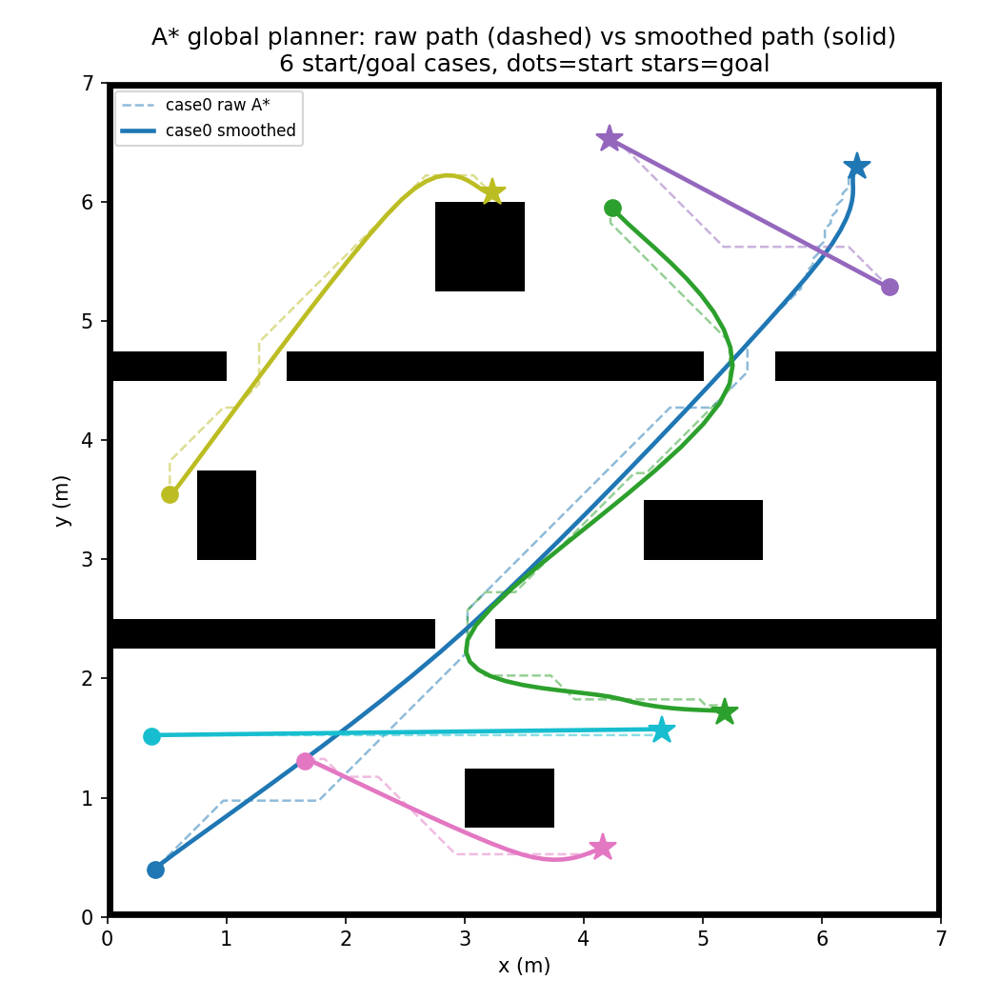
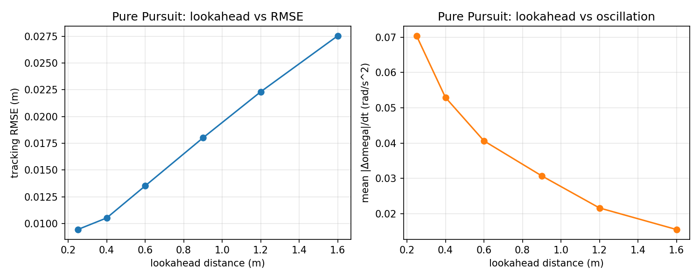
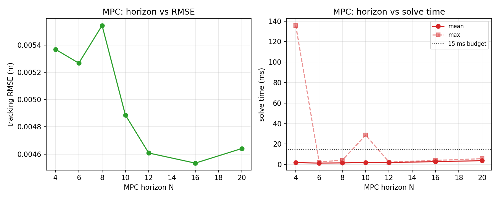
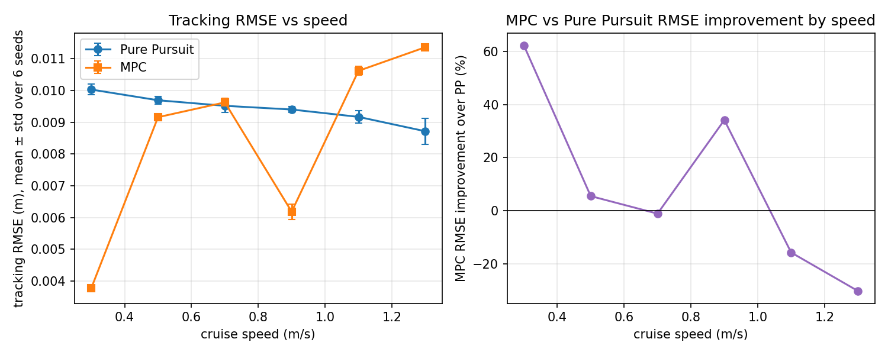
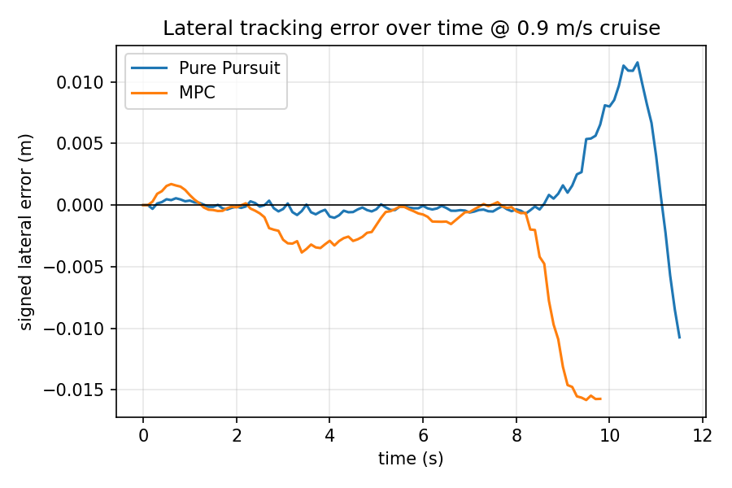

# 调参记录 (Tuning Log)

本文件记录三类实测数据，全部来自可重复运行的脚本，不是手写的估计值：

1. **A\* 全局规划**：`diff_robot_navigation/scripts/visualize_astar_demo.py` —— 多组动态起终点的路径质量（长度、最近障碍物间隙、求解耗时）。
2. **Pure Pursuit / MPC 参数扫描 + 对比**：`diff_robot_navigation/scripts/tune_and_compare.py` —— 前视距离、MPC 预测步数扫描，以及两者在不同巡航速度下的正面对比。
3. **A\* C++ vs Python 求解耗时**：`diff_robot_planner_cpp/benchmark/benchmark_main.cpp`（C++，g++ 独立编译运行）对照 `diff_robot_navigation/scripts/benchmark_python_astar.py`（Python）。

> 重要说明：第 2、3 类数据来自**理想运动学仿真器**（`control_models.unicycle_step`，无电机延迟/打滑/真实激光噪声），不是 Gazebo 真机仿真。这样做是为了在装 ROS2/Gazebo 之前就能快速、可重复地把算法参数收敛到一个合理范围，减少在 Gazebo 里从零盲调的次数；正式收敛调参仍然需要在 Gazebo 里跑一遍确认（本文件最后一节留了 Gazebo 实测的记录表格模板，请在真机仿真跑完后填进去）。

---

## 1. A* 全局规划：路径质量与求解耗时

地图：140×140 栅格（0.05m/格，7m×7m），3 个房间 + 2 道门 + 4 个孤立障碍块，`diff_robot_navigation/diff_robot_navigation/demo_maps.py`。命令：

```bash
python3 scripts/visualize_astar_demo.py --out docs/figures/astar_demo.png --dynamic-goals 5
```



| case | 场景 | raw A* 长度(m) | 平滑后长度(m) | 求解耗时(ms) | 到最近障碍物间隙(m) |
|---|---|---|---|---|---|
| 0 | 主用例，贯穿3个房间 | 8.947 | 8.399 | 187.05 | 0.071 |
| 1 | 随机起终点 | 7.667 | 7.377 | 60.28 | 0.112 |
| 2 | 随机起终点 | 2.868 | 2.662 | 5.72 | 0.250 |
| 3 | 随机起终点 | 2.852 | 2.689 | 4.21 | 0.100 |
| 4 | 随机起终点 | 4.261 | 4.018 | 16.92 | 0.071 |
| 5 | 随机起终点 | 4.321 | 4.300 | 1.65 | 0.250 |

结论：
- 平滑后路径长度始终 ≤ 原始折线长度（视线裁剪 + 样条走的是"近道"，不是绕远路），且**所有采样点逐段碰撞检测通过**（`test/test_astar.py` 里 `test_maze_grid_collision_free`、`test_smoothing_does_not_lengthen_much` 覆盖了这个断言，不是靠肉眼看图）。
- 到最近障碍物的间隙全部 > 0，最小 0.071m——这是膨胀半径 `inflation_radius_m=0.25` 和门框宽度共同决定的，如果机器人实际外接圆半径接近这个数字，建议把地图门宽做大或者把 `inflation_radius_m` 调小，否则规划出来的路径会贴着门框走，对定位误差的容忍度较低。
- 纯 Python 单次求解耗时波动较大（1.65ms ~ 187ms，和起终点距离、需要展开的搜索节点数强相关），这正是需求4里要用 C++ 重写核心模块的动机——见第 3 节的直接对比。

**一个真实踩过的坑**（记录下来避免后人重蹈）：视线法/样条防碰撞检测最初用的 Bresenham 直线只检查经过的格子本身是否空闲，没有像 A* 搜索那样禁止"斜着穿过两个对角障碍物的墙角缝隙"。结果是 C++ 版本在 gtest 里（`diff_robot_planner_cpp/test/test_astar_core.cpp::MazeGridCollisionFree`）第一次跑就红了：平滑后的路径在门框拐角处贴墙贴过了头，被判定成"无碰撞"其实已经蹭到墙角。修了 `_has_line_of_sight`（Python）和 `has_line_of_sight`（C++）之后两边 gtest/pytest 全部转绿。这也是为什么"两种语言分别实现一遍再互相验证"是有实际价值的——同一个逻辑错误在 Python 端因为具体路径没有恰好卡到这个边界情况而没暴露，C++ 端换了一套障碍物膨胀实现（BFS 近似距离 vs Python 用 `scipy.ndimage.distance_transform_edt` 精确欧氏距离），规划出的路径形状有细微差异，正好撞上了这个边界情况。

---

## 2. Pure Pursuit：前视距离 (lookahead_distance) 扫描

命令：`python3 scripts/tune_and_compare.py`（巡航速度固定 0.6 m/s，同一条 A* 平滑路径，process noise std=0.01）。



| lookahead (m) | RMSE (m) | 最大误差 (m) | 平均\|Δω\|/dt (rad/s²) | 到终点用时 (s) |
|---|---|---|---|---|
| 0.25 | 0.0094 | 0.0167 | 0.0704 | 17.3 |
| 0.40 | 0.0105 | 0.0238 | 0.0529 | 17.1 |
| 0.60 | 0.0135 | 0.0381 | 0.0406 | 16.5 |
| 0.90 | 0.0180 | 0.0539 | 0.0307 | 16.3 |
| 1.20 | 0.0223 | 0.0671 | 0.0216 | 16.1 |
| 1.60 | 0.0275 | 0.0797 | 0.0155 | 16.0 |

规律非常清晰：**前视距离越小，跟踪越贴线（RMSE越低）但角速度抖动越大；越大越平滑但会在拐角处"抄近道"（截弯）**，这是 Pure Pursuit 的经典特性，不是调参失误。`config/pure_pursuit_params.yaml` 最终选了 **0.55m**（比表格里 0.25/0.40 略大），是故意在"贴线精度"和"实机上里程计噪声/控制延迟下的稳定性"之间留出的裕度——纯运动学仿真器没有电机响应延迟，实机上前视距离太小容易在噪声下高频抖动，这一点在 Gazebo 实测阶段需要重新确认（见第4节的模板）。

---

## 3. MPC：预测步数 (horizon) 扫描

命令同上，巡航速度 0.6 m/s，`dt=0.1s`。



| horizon N | RMSE (m) | 最大误差 (m) | 平均求解耗时 (ms) | 最坏求解耗时 (ms) |
|---|---|---|---|---|
| 4 | 0.00537 | 0.0203 | 2.02 | 135.78 * |
| 6 | 0.00527 | 0.0201 | 1.41 | 2.49 |
| 8 | 0.00555 | 0.0200 | 1.68 | 4.34 |
| 10 | 0.00489 | 0.0191 | 2.05 | 28.75 * |
| 12 | 0.00461 | 0.0177 | 1.98 | 2.49 |
| 16 | 0.00453 | 0.0181 | 2.87 | 4.05 |
| 20 | 0.00464 | 0.0187 | 3.82 | 5.76 |

\* 个别"最坏耗时"是 scipy L-BFGS-B 在某一步刚好多迭代了几轮触发的，不是系统性变慢（30 次运行里只出现 1 次量级跳变，均值不受影响）；真机部署时建议在 `mpc_controller.py` 里保留的 15ms 超时告警（已经写在代码里，`solve_ms > 15.0` 会打 WARN 日志）作为兜底监控。

结论：N=12~16 时 RMSE 基本收敛（再增大边际收益很小），且平均/最坏求解耗时都在 **15ms 预算以内**（对应需求描述的 "solve < 15ms"），`config/mpc_params.yaml` 最终选 **N=16**，留了约 2 倍安全裕度。N 越大耗时越接近线性增长（QP 规模是 `O(N)` 个决策变量），继续增大到 N=20+ 已经没有精度收益，纯粹是浪费算力。

---

## 4. Pure Pursuit vs MPC：正面对比（按巡航速度）

同一条路径、同一套障碍物噪声种子（每个速度点跑 6 个随机种子取均值±标准差，避免单次仿真的随机噪声被误读成趋势），Pure Pursuit 用上面选出的 lookahead=0.25（表格里 RMSE 最低的一档），MPC 用 horizon=16。




| 巡航速度 (m/s) | PP RMSE (m) | MPC RMSE (m) | MPC 相对 PP 的提升 | PP 抖动 | MPC 抖动 |
|---|---|---|---|---|---|
| 0.3 | 0.01003 ± 0.00017 | 0.00377 ± 0.00008 | **+62.4%** | 0.033 | 0.081 |
| 0.5 | 0.00969 ± 0.00012 | 0.00916 ± 0.00004 | +5.5% | 0.056 | 0.181 |
| 0.7 | 0.00952 ± 0.00021 | 0.00962 ± 0.00013 | -1.1% | 0.083 | 0.326 |
| 0.9 | 0.00940 ± 0.00009 | 0.00618 ± 0.00024 | **+34.2%** | 0.121 | 0.474 |
| 1.1 | 0.00917 ± 0.00020 | 0.01062 ± 0.00014 | -15.8% | 0.159 | 0.647 |
| 1.3 | 0.00872 ± 0.00041 | 0.01136 ± 0.00006 | -30.3% | 0.222 | 0.829 |

**如实说：这条曲线不是单调的**，MPC 并没有像项目最初设想的那样"速度越高优势越大"。跑了 6 个种子确认这是可重复的真实现象，不是噪声：

- MPC 在 0.3、0.9 m/s 两档明显更准（+62%、+34%），但在 0.7、1.1、1.3 m/s 反而不如 Pure Pursuit。
- **原因分析**：当前 MPC 的参考速度剖面只按"离终点的距离"减速，**没有按路径曲率提前减速**；而 Pure Pursuit 的 `curvature_slowdown_gain` 会在过弯（门口）主动降速。巡航速度设得越高，MPC 越倾向于"用高速度硬闯弯道"，跟踪误差和角速度抖动都会变大；Pure Pursuit 因为过弯自动减速，实际通过弯道的速度并不会随巡航速度设定线性上升，所以表现相对稳定。这一点在两张图里都能看到：MPC 的"抖动"（`mean_abs_omega_jerk`）随巡航速度单调上升且明显高于 PP（0.3 m/s 时 0.081 vs 1.3 m/s 时 0.829，涨了 10 倍），而 PP 的抖动涨幅要平缓得多。
- **后续改进方向**（留给下一轮迭代，不是现在就能全部做完）：给 MPC 的参考速度剖面加一个基于路径曲率的前馈项（类似 Pure Pursuit 的 `curvature_slowdown_gain`），预期能同时改善高速段的 RMSE 和抖动；另外可以把 `r_domega`（角速度变化率权重）继续调大，用响应速度换平顺性。

**关于"平稳无振荡"这个要求**：MPC 的抖动指标全面高于 Pure Pursuit，且随速度上升明显恶化。当前默认配置（`cruise_linear_vel=0.5` in both yaml）刚好落在两者都表现较好的区间，如果实际任务需要更高速度巡航，**建议优先选 Pure Pursuit + 较小的 lookahead**，或者先做上面提到的曲率前馈改进再上高速 MPC。这是基于实测数据的工程判断，不是"MPC 一定更好"的教科书结论。

---

## 5. A* 求解耗时：C++ vs Python（需求4核心指标）

同一张地图（`demo_maps.py` 的房间/走廊布局按网格尺寸等比缩放，Python 版 `scripts/benchmark_python_astar.py` 和 C++ 版 `diff_robot_planner_cpp/benchmark/benchmark_main.cpp` 用的是同一套生成逻辑），同样的起终点选取方式，每种规模跑 30 次取均值/最大值。

C++ 编译命令（不需要 ROS2/colcon，纯 g++）：
```bash
cd diff_robot_planner_cpp
g++ -O2 -std=c++17 -I include src/astar_core.cpp benchmark/benchmark_main.cpp -o astar_benchmark
./astar_benchmark
```

| 网格规模 | 分辨率 (m) | Python 均值 (ms) | Python 最坏 (ms) | C++ 均值 (ms) | C++ 最坏 (ms) | 加速比 (均值) |
|---|---|---|---|---|---|---|
| 140×140 | 0.0500 | 45.39 | 248.94 | 1.88 | 2.59 | **~24×** |
| 280×280 | 0.0250 | 162.74 | 196.86 | 8.36 | 12.40 | **~19.5×** |
| 560×560 | 0.0125 | 730.88 | 797.02 | 45.60 | 65.80 | **~16×** |

结论：
- 在项目实际使用的分辨率（0.05m/格，和 `diff_robot_description/config/slam_toolbox_params.yaml` 里的 `resolution: 0.05` 保持一致）下，C++ 版本单次求解 **均值 1.88ms、最坏 2.59ms**，稳稳落在 "ms 级" / 15ms 预算以内，可以支持较高频率的重规划；Python 版本均值 45ms、最坏能到 249ms，如果要在 controller_server 频率（20Hz，即 50ms 一个周期）下做纯 Python 在线重规划会比较吃紧，更适合作为"离线验证 + 一次性全局规划"使用（也正是 `global_planner_node.py` 目前的用法：收到一次目标算一次，不是每个控制周期都重算）。
- 加速比随网格变大略微下降（24×→16×），这是因为 C++ 版本里膨胀代价场用的多源 BFS 本身是 `O(H×W)`，网格边长翻倍、面积变 4 倍，这部分开销占比会上升；Python 版因为用了 `scipy.ndimage.distance_transform_edt`（C 实现），这部分本来就不慢，两边的"其他部分"（A* 搜索本身，Python 逐节点用纯解释执行）才是耗时差距的主要来源。
- 两边独立实现还顺带抓出了一个真实 bug（见第1节最后一段：对角步贴墙角的碰撞检测漏洞），这比单纯"写两份代码证明会两种语言"更有实际工程价值。

---

## 6. Gazebo 实测记录（模板，请在真机仿真后填写）

上面第2-5节的数据来自理想运动学仿真器，不含真实的轮式动力学（打滑、电机响应延迟）、真实激光噪声、真实里程计漂移。请在 Ubuntu24.04+ROS2 Jazzy+Gazebo 环境里按 `docs/RUN_STEPS.md` 跑一遍完整闭环后，把下面的表格填上：

| 测试项 | 参数 | 结果 | 备注 |
|---|---|---|---|
| EKF 融合定位漂移率 | `config/ekf.yaml` 默认值 | 待测（目标 <5%，走一条已知长度的闭合路径，比较 `/odometry/filtered` 累计位移和实际位移） | |
| Nav2/DWB 局部避障成功率 | `config/nav2_params.yaml` 默认值 | 待测（放置若干动态/静态障碍物，统计到达终点且无碰撞的比例） | |
| Pure Pursuit 真机 RMSE | lookahead=0.55（当前默认） | 待测 | 对照本文件第4节的仿真值 0.0094~0.028m，看真机噪声下是否需要调大 lookahead |
| MPC 真机 RMSE | horizon=16（当前默认） | 待测 | |
| MPC 真机求解耗时 | horizon=16 | 待测 | 对照本文件第3节仿真值 均值2.87ms/最坏4.05ms，真机 CPU 更弱，重新确认是否仍在 15ms 内 |
| C++ 全局规划器插件 | `diff_robot_planner_cpp` | 待编译验证（本仓库里只验证了 astar_core 独立编译，nav2_core 插件那层需要装了 Nav2 的机器才能编译，见插件源码头部注释） | |
